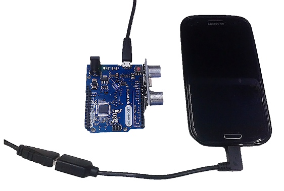
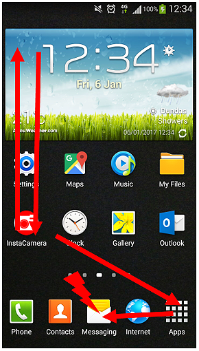
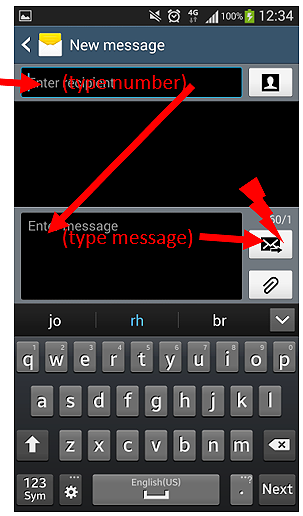
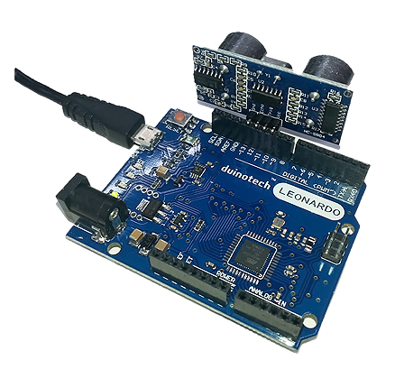

# Android Phone Notifier

You might be surprised to find how easy it is to control an Android phone with an Arduino. We're using a Leonardo board to emulate a keyboard, and use this to send commands to the phone. In this project, we've hooked up an Ultrasonic Sensor Module as the trigger, and then commanding the phone to send a text message with the distance measured if something is detected too close, but like any Arduino project, you can customize it as much as you like.



The catch is that your phone must support OTG, or ‘On-The-Go' technology. This simply means that the USB connector on your phone (which normally goes to a ‘host' device like a computer), can also accept connections to ‘slave' devices like USB sticks, mouses and keyboards. Then all you need is an OTG adapter like [WC7725](https://jaycar.com.au/p/WC7725). Here's the secret- we need to get it to send the right sequence of keystrokes to do what we want- in this case, send an SMS when a sensor is triggered.

If you're not sure if your phone supports OTG, then you can try plugging a keyboard into an OTG adapter into your phone, and seeing if it responds and registers keystrokes. If it does, then you're good to go.

Three more important points: the keyboard can't unlock the phone, so it has to be left unlocked to work (once it's unlocked, the Leonardo sends periodic keystrokes to keep the phone from sleeping), and the OTG adapter is also the charging port, so you might have to investigate alternative charging methods to the USB port if you're going to set the Android Phone Alerter for extended periods. In fact, the phone is powering the Leonardo board as well.

Finally, every phone is different, so the keystrokes you need to get the result you want might be different- there's instructions for testing this below.

## Shopping List:
|Qty| Code | Description |
|---|---|---|
|1 | [XC4430](http://jaycar.com.au/p/XC4430) | main board
|1 | [WC7725](http://jaycar.com.au/p/WC7725) | OTG adapter
|1 | [XC4442](http://jaycar.com.au/p/XC4442) | Ultrasonic distance

## Testing:

The first thing that needs to be done is to test what sequence of keystrokes are needed to send a message using just a USB keyboard with your phone, so connect a keyboard to the phone via the OTG adapter.

Here's a short list of keys, their Android functions and the Arduino key-codes we used:

|Keyboard Key|Android Function|Arduino Code
|---|---|---
|ESC|Back|177
|Up Arrow|Up|218
|Down Arrow|Down|217
|Left Arrow|Left|216
|Right Arrow|Right|215
|Enter|Activate|176

If you can't do what you need with the above keys, but you can do it with other keys on a regular keyboard, you can map them to Arduino key-codes with this document:

[https://www.arduino.cc/en/Reference/KeyboardModifiers](https://www.arduino.cc/en/Reference/KeyboardModifiers)

You'll notice that when the keyboard is connected, a selection box appears, and can be moved around the screen with the arrow keys- this is how we navigate. It seems easy enough, but the Leonardo doesn't have any feedback as to where the selection box is, so we need to design our key sequence to work regardless of where the selection box is.

The sequence we used is (working on a Samsung Galaxy S3, with the Messaging app in the middle of the quick access apps at the bottom of the screen) is:

```
Back, back, back, back (to back out of anything we're in)
Up, up, up, up, up (to make sure we're out of the quick access area)
Down, down, down, down, down (into quick access area)
Left, left (on top of Messaging Icon)
Enter (Start Messaging app)
```

We've used an app in the quick access area because it appears
on every page, and it doesn't matter what page we're on.



And that's just to get into the app! Your sequence may be different, depending on your screen layout and icon positions. After that, we use:

```
Up, enter (select new message)
Type phone number
Enter, down (move to text field)
Type text
Right, enter (move to send button and press)
```



You should work out your own sequence, and try it with the selection box starting in different locations, even in different apps and see that your sequence works. It's better to experiment here with the keyboard, because it's easier to stop if you know you're going to activate something incorrect.

There's no reason you have to send a message- you could activate the camera to take a picture, then send that as an MMS, or send an email- as long as you can repeatedly trigger the function with the same sequence of keystrokes.

Then, you should convert your keystrokes into the corresponding Arduino codes, using a 0 to mark the end of the list:

```c
byte cmds[]={
177,177,177,177,        //back a few times, in case we're in something
218,218,218,218,218,    //up a few times
217,217,217,217,217,    //down a few times
216,216,                //left twice
176,                    //enter to messaging app
218,                    //up to new message
176,                    //enter
0                       //so we know the end of list
};
sendcmds(cmds);
```

The sendcmds() function can send an array of commands, as shown above, or even a single command, eg:

```c
sendcmds(176);              //enter```

And it places a one second delay after each keystroke so as to not overwhelm the phone. You might find you need a longer delay in some cases (especially if the action is opening an app).

If you need to send text, use this:

```c
Keyboard.print("Sensor has been triggered!");   //message text
```

And place a delay after it.

## Construction:

To keep things simple, we set the sketch to power the Ultrasonic Sensor Module through the digital pins- simply push the Ultrasonic Sensor Module onto pins 10-13, with VCC in D10, and GND in D13. This will have the Ultrasonic Sensor Module aiming away from the Leonardo board.



The only other thing to be done after you've uploaded the sketch, is to attach the Leonardo to the phone with the OTG lead.

## Sketch:

There are no unusual libraries in this sketch- they Keyboard library should be included with recent versions of the IDE. Modify the sketch to contain your key sequence, then upload it, keeping in mind the correct board and serial port. If you're having trouble uploading to the Leonardo, try a double-click on the reset button (this forces the bootloader to activate).

Keep in mind that the Leonardo is behaving like a keyboard now, so it might send keystrokes to anything it's connected to, including your computer. There's a five second delay at the start of the sketch to help you avoid that. Plug it into the phone, and trigger the Ultrasonic Sensor by waving a hand in front of it (the D13 LED on the Leonardo will light up while the key sequence is running). Visually check that the message is activated properly. If you can't keep up, or it seems to be skipping steps, the delay() values can be extended. Remember that the phone must be unlocked, and occasionally sends ‘back' keystrokes to keep the screen awake. There's a 10 minute timeout between alerts to avoid overloading the phone, so you might need to reset the Leonardo if you need to keep testing.

## Improvements:

As you can see, it's fairly fiddly to get our phone to do what we want, but once it's worked out, you're really only limited by what the phone can do. You could take a photo or video and send it via email or upload to the cloud, dial a number, play a sound with a media app, or even generate a tweet.

You aren't restricted to fixed messages either- just like we added the Ultrasonic sensor distance to the message, the Keyboard.print() function can also output numbers from variables, so you can have another sensor value or timestamp in your message. Basically anything that can be print()ed can be output in message text.

You can also use a mouse via an OTG connection, and because the Leonardo can also emulate a mouse, you could use this to control the phone as well. See [https://www.arduino.cc/en/Reference/MouseKeyboard](https://www.arduino.cc/en/Reference/MouseKeyboard)
for more information about how the mouse interface works.

The Keyboard and Mouse libraries work on any ATMega32u4 based Arduino board, so you could also use a [Lilypad USB](https://jaycar.com.au/p/XC4620) to perform these functions.
